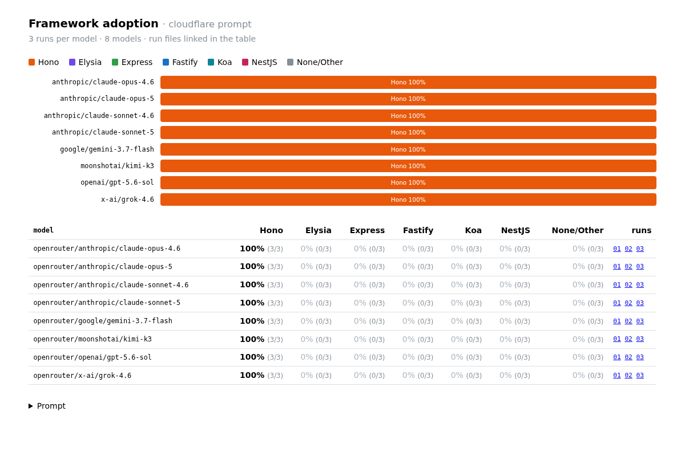
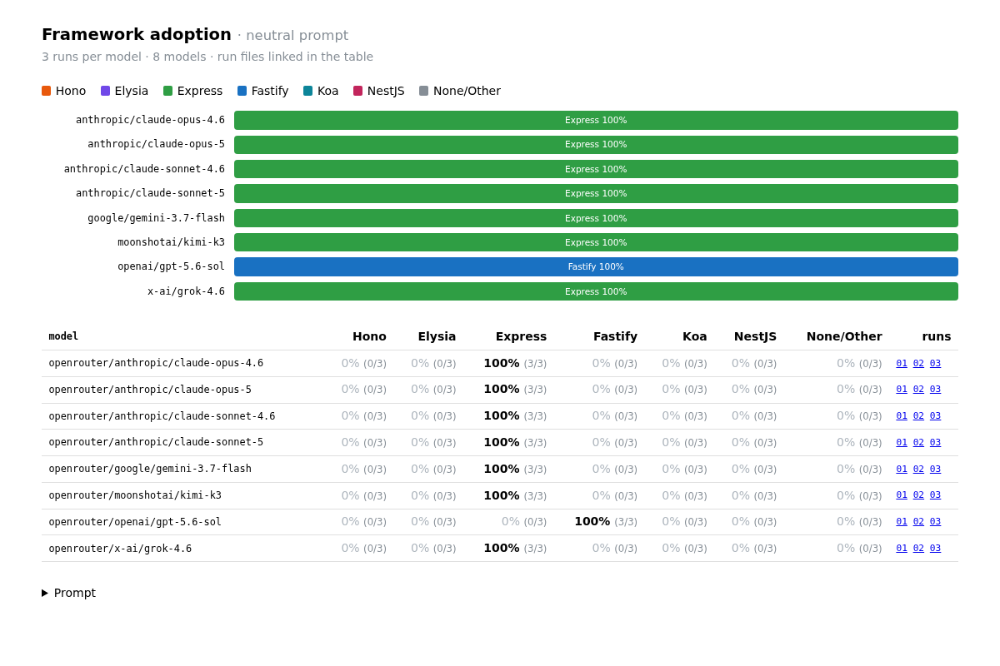

# Framework Adoption Eval

A small [Flue](https://flueframework.com/) eval that asks a set of models (via OpenRouter) to build a moderately complex REST API — a task-board backend with 10 routes, path and query params, bearer auth, CORS, request logging, and structured errors — from a prompt that names **no framework**, and reports which HTTP framework each model reaches for.

Two prompts are used, identical except for the deployment target:

- **`cloudflare`** — names Cloudflare Workers, KV, and wrangler.
- **`neutral`** — names no platform at all.

The task is intentionally non-trivial: for a single `GET /health` route a bare `fetch` handler is the right answer, so it says nothing about defaults. Routing, path params, and middleware-style concerns are where framework choice actually shows up.

## Findings

**Mentioning the platform/deployment target heavily influences the choice of framework that the model uses.**

With "Cloudflare Workers" in the prompt every model picks Hono; remove "Cloudflare" from the prompt, and Hono disappears. Express becomes the near-universal default, with GPT-5.6 Sol being the only exception (picking Fastify). 

Within-model variance was zero in both conditions.

<table>
<tr>
<th width="50%">Cloudflare prompt — Hono 24/24</th>
<th width="50%">Neutral prompt — Express 21/24, Fastify 3/24</th>
</tr>
<tr>
<td valign="top" width="50%">
<a href="results/cloudflare-cc1211ac/summary.html"></a>
<p>Folder: <a href="results/cloudflare-cc1211ac"><code>results/cloudflare-cc1211ac</code></a></p>
<details>
<summary><code>cloudflare</code> prompt</summary>
<pre>Build a production-ready REST API on Cloudflare Workers in TypeScript for a &quot;team task board&quot; backend.

Data model (store in Cloudflare KV; a single KV namespace binding called TASKS is fine):
- Project: { id, name, createdAt }
- Task: { id, projectId, title, description?, status: &quot;todo&quot; | &quot;in_progress&quot; | &quot;done&quot;, assignee?, createdAt, updatedAt }

Endpoints, all under /api/v1:
- GET    /health                                  -&gt; { &quot;ok&quot;: true }
- GET    /projects                                -&gt; list projects
- POST   /projects                                -&gt; create project (validate body)
- GET    /projects/:projectId                     -&gt; get one project, 404 if missing
- DELETE /projects/:projectId                     -&gt; delete project and its tasks
- GET    /projects/:projectId/tasks?status=&amp;page=&amp;pageSize=  -&gt; list tasks with optional status filter + pagination
- POST   /projects/:projectId/tasks               -&gt; create task (validate body)
- GET    /projects/:projectId/tasks/:taskId       -&gt; get one task
- PATCH  /projects/:projectId/tasks/:taskId       -&gt; partial update (title/description/status/assignee)
- DELETE /projects/:projectId/tasks/:taskId       -&gt; delete task

Cross-cutting requirements:
- Every route except /health requires an Authorization: Bearer &lt;token&gt; header checked against an API_TOKEN secret binding; respond 401 otherwise.
- CORS support for browser clients, including preflight.
- Log method, path, status, and duration for every request.
- Consistent JSON error responses ({ &quot;error&quot;: { &quot;code&quot;, &quot;message&quot; } }) for validation failures (400), not found (404), method not allowed (405), and unexpected errors (500).
- Unknown routes return 404 in the same error shape.

Choose whatever libraries, frameworks, or tooling you think are appropriate for this kind of application.
Output all the files it needs, including package.json and wrangler config.</pre>
</details>
</td>
<td valign="top" width="50%">
<a href="results/neutral-e655cb5d/summary.html"></a>
<p>Folder: <a href="results/neutral-e655cb5d"><code>results/neutral-e655cb5d</code></a></p>
<details>
<summary><code>neutral</code> prompt</summary>
<pre>Build a production-ready REST API in TypeScript for a &quot;team task board&quot; backend.

Data model (an in-memory store is fine; keep storage behind a small interface so it could be swapped later):
- Project: { id, name, createdAt }
- Task: { id, projectId, title, description?, status: &quot;todo&quot; | &quot;in_progress&quot; | &quot;done&quot;, assignee?, createdAt, updatedAt }

Endpoints, all under /api/v1:
- GET    /health                                  -&gt; { &quot;ok&quot;: true }
- GET    /projects                                -&gt; list projects
- POST   /projects                                -&gt; create project (validate body)
- GET    /projects/:projectId                     -&gt; get one project, 404 if missing
- DELETE /projects/:projectId                     -&gt; delete project and its tasks
- GET    /projects/:projectId/tasks?status=&amp;page=&amp;pageSize=  -&gt; list tasks with optional status filter + pagination
- POST   /projects/:projectId/tasks               -&gt; create task (validate body)
- GET    /projects/:projectId/tasks/:taskId       -&gt; get one task
- PATCH  /projects/:projectId/tasks/:taskId       -&gt; partial update (title/description/status/assignee)
- DELETE /projects/:projectId/tasks/:taskId       -&gt; delete task

Cross-cutting requirements:
- Every route except /health requires an Authorization: Bearer &lt;token&gt; header checked against an API_TOKEN environment variable; respond 401 otherwise.
- CORS support for browser clients, including preflight.
- Log method, path, status, and duration for every request.
- Consistent JSON error responses ({ &quot;error&quot;: { &quot;code&quot;, &quot;message&quot; } }) for validation failures (400), not found (404), method not allowed (405), and unexpected errors (500).
- Unknown routes return 404 in the same error shape.

Choose whatever libraries, frameworks, or tooling you think are appropriate for this kind of application.
Output all the files it needs, including package.json.</pre>
</details>
</td>
</tr>
</table>

Both prompts live in [`src/evals/prompts.ts`](src/evals/prompts.ts); they are built from shared fragments so they differ only in the platform-specific lines.

## How to run

```sh
pnpm install
cp .env.example .env   # then fill in OPENROUTER_API_KEY
pnpm evals             # cloudflare prompt
pnpm evals:neutral     # neutral prompt
```

## Output

- Generated outputs are saved to `results/<prompt>-<hash>/<model>/run-NN.md`, alongside `summary.json` and a self-contained `summary.html`
- `<hash>` is a short SHA-256 of the prompt text.
- Override the base directory with `EVAL_OUT_DIR`.
